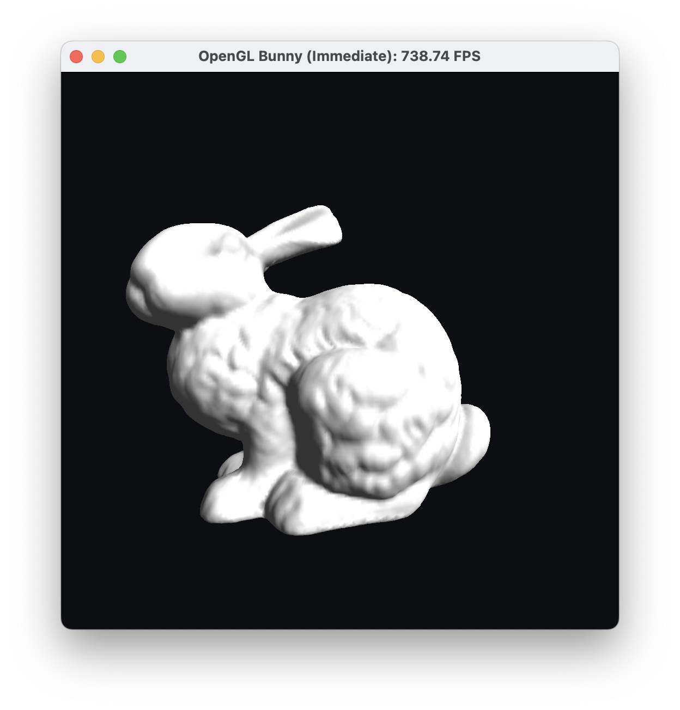
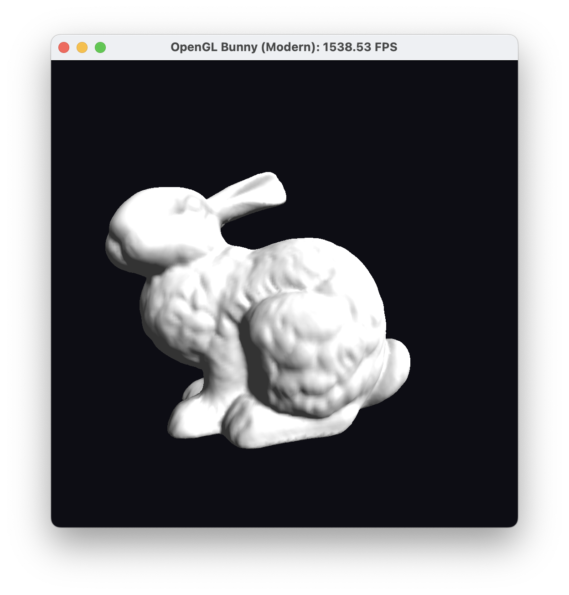

# Overview

This project implements a simple OpenGL renderer that loads and displays a triangle mesh (Stanford bunny) using both immediate mode and vertex arrays(modern mode). The program measures and displays the rendering FPS in the window title, applying specified transformations and lighting parameters.

> **Tip:**
> Change the `MODE` constant in the main file to switch between immediate mode and modern (vertex array) rendering. Although the solution contains two projects, both are essentially part of the same assignment and share the core logic. Set `MODE_IMMEDIATE` to use OpenGL immediate mode, or `MODE_MODERN` to use vertex arrays.

# How to Compilation & Run

1. **Clone the Repository:**
   First, clone this repository to your local machine using Git.

2. **Open the Project in Visual Studio:**
   - Open Visual Studio and select `File` -> `Open` -> `Project/Solution`.
   - Navigate to the folder where you cloned the repository and open the project file (usually `.sln`).

3. **Build the Project:**
   - In Visual Studio, go to `Build` -> `Build Solution` or press `Ctrl + Shift + B` to compile the project.
  
4. **Set the Project as Startup Project:**
	- In the Solution Explorer, right-click the project you want to run.
	- Select `Set as Startup Project`.

5. **Run the Project:**
   - After the build is complete, run the project by selecting `Debug` -> `Start Debugging` or pressing `F5`.

# Result Screenshots

## Q1 - immediate mode

## Q2 - modern mode

